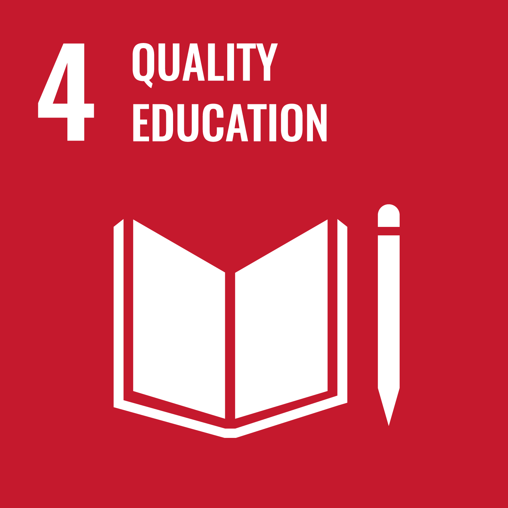
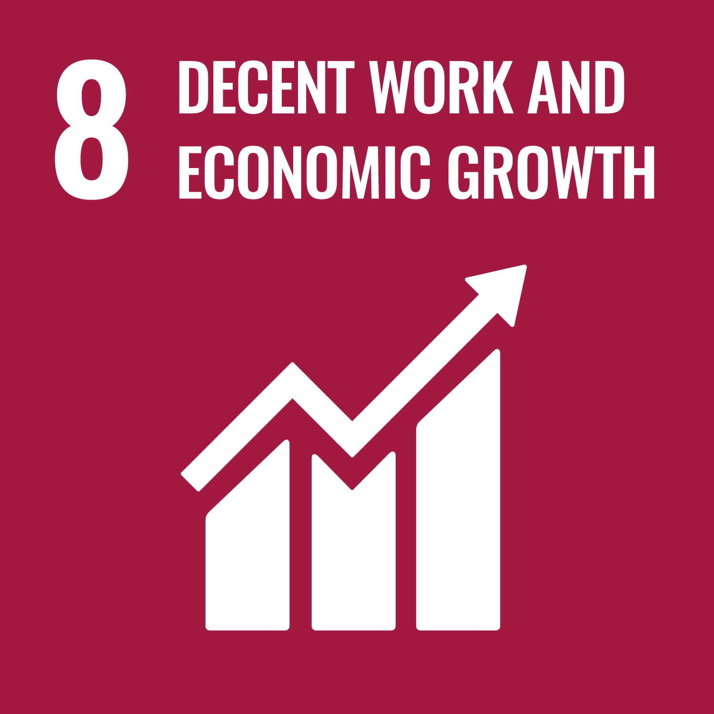

---
# Display name
title: Srinivas Raghavendra

# Name pronunciation (optional)
# name_pronunciation: Chien Shiung Wu

# Full name (for SEO)
first_name: Srinivas
last_name: Raghavendra

# Status emoji
# status:
#   icon: ☕️

# Is this the primary user of the site?
superuser: true

# Highlight the author in author lists? (true/false)
highlight_name: true

# Role/position/tagline
# role: Associate Professor

# Organizations/Affiliations to display in Biography blox
organizations:
  - name: University of Galway, Ireland
    url: https://www.universityofgalway.ie/our-research/people/business-and-economics/sraghav/

# Social network links
# Need to use another icon? Simply download the SVG icon to your `assets/media/icons/` folder.
profiles:
  # - icon: at-symbol
  #   url: 'mailto:your-email@example.com'
  #   label: E-mail Me
  # - icon: brands/x
  #   url: https://twitter.com/GetResearchDev
  # - icon: brands/instagram
  #   url: https://www.instagram.com/
  # - icon: brands/github
  #   url: https://github.com/gcushen
  - icon: brands/linkedin
    url: https://in.linkedin.com/in/raghav-srinivas-55b50029
  - icon: academicons/google-scholar
    url: https://scholar.google.co.in/citations?user=X2L05dgAAAAJ&hl=en
  - icon: academicons/orcid
    url: https://orcid.org/0000-0003-2058-822X

interests:
  - Macroeconomics
  - Development
  - Complex Systems
  - Feminist Economics

education:
  - area: PhD Economics
    institution: Jawaharlal Nehru University, India
  - area: M.Sc. Statistics
    institution: Annamalai University, India
  - area: B.Sc. Mathematics
    institution: Madura College, Madurai Kamaraj University, India
---

## About Me

I am a macroeconomist. My work spans three connected strands: how financialisation shapes macroeconomic stability, how development can be understood through a macro-structural lens, and how gender belongs at the centre of economic analysis, not its margins.

### SDG Footprint

     

